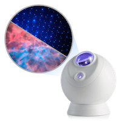

    

# Homebridge Sky Lite Evolve

## Description

A [Homebridge](https://homebridge.io/) plugin for the [BlissLights Sky Lite Evolve&reg;](https://blisslights.com/products/sky-lite-evolve)
star projector.

[Seydx](https://github.com/seydx) has an [excellent plugin](https://github.com/seydx/homebridge-star-projector/tree/master)
for the general category of Tuya-based star projectors, but the Sky Lite Evolve doesn't appear to work with the underlying library, TuyAPI
(but please let me know if you were able to get it working!). Inspecting the Sky Lite Evolve after adding it to a cloud project in the
[Tuya IoT Cloud](https://iot.tuya.com/), there don't appear to even be number-based DPS codes. Hence, this plugin. That
said, this plugin borrows heavily in concept from Seydx's, particularly in how the accessories are mapped.

One thing that is important to note is that, instead of local or remote control using DPS values, this plugin uses the Tuya API directly to
issue device commands via the Tuya IoT Cloud.

This plugin exposes the following accessories to HomeKit:

- A power switch
- That's it for now. I'm working on adding more services to this accessory, for the colors, laser, rotation, etc.

## Table of Contents

- [Installation](#installation)
- [Usage](#usage)
- [Contributing](#contributing)
- [License](#license)

## Installation

In Homebridge, on the plugins tab, search for homebridge-sky-lite-evolve and then click the download/install icon on the result from @kevbo.
Once installed, go to the plugins tab and click the configuration button in the upper right corner of the card.

If you haven't already done so, you will need to create a [Tuya IoT Cloud](https://iot.tuya.com/) account and create a cloud project
containing your device(s). Your cloud project will have an access key and a secret key, and your device will be given a virtual device id.
You will need these three values in order to configure this plugin. The TuyAPI project has [some good instructions](https://github.com/codetheweb/tuyapi/blob/master/docs/SETUP.md#listing-tuya-devices-from-the-tuya-smart-or-smart-life-apps) on how to set this all up. Note that this may require that you 
set up your device via the Tuya Smart app and not the BlissHome app, but this does not reduce the functionality of your device.

Alternately, you can install it manually from the command line:

    sudo npm i -g homebridge-sky-lite-evolve@latest

## Usage

After installation and configuration, you should now see the Evolve switch accessory on the Homebridge accessories tab. Assumming you've
registered your Homebridge instance as a HomeKit bridge through your iOS/iPadOS Home app, you should see it there, too.

## Contributing

You can contribute to this Homebridge plugin in a number of ways:

- [Report issues](https://github.com/kevbo/homebridge-sky-lite-evolve/issues) and help verify Pull Requests as they are merged
- Help review [Pull Requests](https://github.com/kevbo/homebridge-sky-lite-evolve/pulls)
- Contribute bug fixes
- Contribute changes to extend the capabilities of this plugin (see [TODO.md](TODO.md))

## Credits

- I'd like to thank [Seydx](https://github.com/seydx) for his [homebridge-star-projector plugin](https://github.com/seydx/homebridge-star-projector),
which I used as a template for the accessory layout.

## License

This project is distributed under the [MIT License](LICENSE)